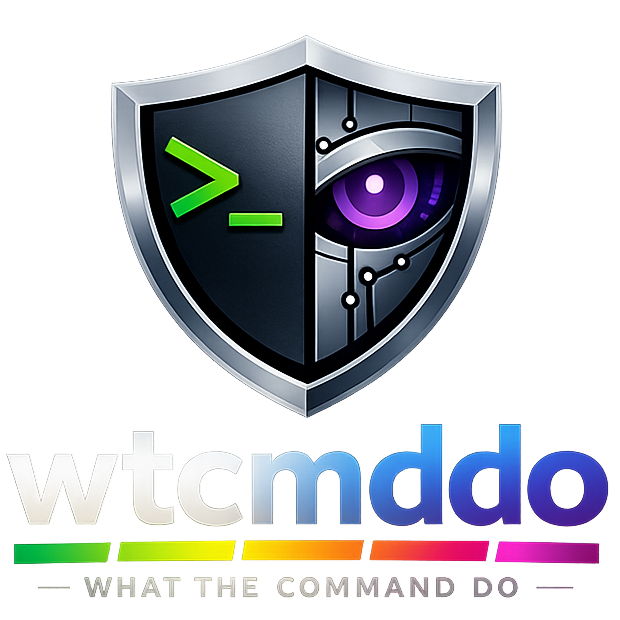

<div align="center">



# wtcmddo

**What The Command Do** — a lightweight command explainer with guardrails.

[](https://www.python.org/)
[](https://rich.readthedocs.io/)
[](https://platform.openai.com/docs/api-reference)
[](#)
[](#)

*Don't just run it — **understand** it first.*

</div>

---

## Overview

`wtcmddo` is a terminal-native security companion for the command line. Paste any shell command and it calls an LLM to produce a **detailed explanation**, a **color-coded risk assessment**, and a **reason** — then asks for your confirmation before executing. Think of it as a second pair of eyes that reads the command back to you in plain English before anything hits your shell.

> Built on the OpenAI-compatible SDK, so it works with OpenRouter, OpenAI directly, local LLMs, or any provider that speaks the same API.

## Features

| Feature | What it does |
|---------|--------------|
| **Rich TUI** | Color-coded panels, animated spinner, and styled prompts powered by `rich` |
| **Live analysis** | A spinner animates while the API thinks, so you always know it's working |
| **Risk levels** | Every command is tagged `LOW` · `MEDIUM` · `HIGH` · `CRITICAL` with matching colors |
| **Detailed explanations** | One-to-two sentence breakdowns covering flags, options, and effects — not just a label |
| **Guardrails** | Refuses non-commands, never rewrites or suggests alternatives, stays strictly analytical |
| **Confirm before run** | Interactive yes/no prompt before anything executes (or skip with `--yes`) |
| **Setup wizard** | A guided `--setup` flow with masked key entry and a config summary panel |
| **Provider-agnostic** | Point `--base-url` at any OpenAI-compatible endpoint and switch models freely |

## Installation

```bash
git clone https://github.com/Zaeem20/wtcmddo.git
cd wtcmddo
uv sync          # recommended (uses uv_build)
# or
pip install .
```

## Configuration

There are two ways to provide your API key.

**Option A — Interactive wizard** (recommended)

```bash
wtcmddo --setup
```

This launches a guided setup with masked input and a summary panel. Configuration is saved to `~/.wtcmddo/config.json`.

**Option B — Environment variable**

```bash
export OPENROUTER_API_KEY="sk-or-v1-..."
```

The env var is used as a fallback when no key is set in the config file.

## Usage

```bash
wtcmddo ls -la
whatcmd git status
explain "rm -rf /"
explaincmd --dry-run curl https://example.com
```

The tool ships under **four aliases** — `wtcmddo`, `whatcmd`, `explaincmd`, and `explain` — all pointing to the same entry point.

### Example output

```
┌─ $ rm -rf / ───────────────────────────────────────────────────────────────┐
│                                                                            │
│  This command forcefully removes all files and directories from the root   │
│  directory and its subdirectories without prompting for confirmation,      │
│  effectively wiping the entire filesystem.                                 │
│                                                                            │
│  Risk    CRITICAL                                                          │
│  Reason  The command performs a recursive and forceful deletion of all     │
│          files, which can result in total data loss.                       │
│  Type    DATA_DESTRUCTION                                                  │
│                                                                            │
└────────────────────────────────────────────────────────────────────────────┘

Execute this command [y/N]:
```

The panel border and risk label are color-coded to the risk level, so dangerous commands grab your attention instantly.

## Flags

| Flag | Short | Description |
|------|:-----:|-------------|
| `--setup` | | Run the interactive setup wizard |
| `--model` | | Override the configured model |
| `--base-url` | | Override the API base URL (any OpenAI-compatible endpoint) |
| `--yes` | `-y` | Skip confirmation and execute immediately |
| `--dry-run` | `-n` | Explain only; never ask to execute |

## Risk Levels

| Level | Color | Meaning |
|-------|:-----:|---------|
| `LOW` | 🟢 Green | Read-only, lists files, shows status, harmless inspection |
| `MEDIUM` | 🟡 Yellow | Reads sensitive files, sends non-destructive network data, installs packages |
| `HIGH` | 🔴 Red | Modifies files/system state, deletes data, changes configuration, runs remote scripts |
| `CRITICAL` | 🟣 Magenta | Wipes storage, recursive deletes, privilege escalation, raw disk writes, mass exfiltration |

### Command categories

Every command is also classified into one of: `FILE` · `NETWORK` · `SYSTEM` · `PRIVACY` · `DATA_DESTRUCTION` · `OTHER`.

## Provider Switching

Because the tool uses the OpenAI SDK with a configurable base URL, you can point it at any compatible endpoint:

```bash
# OpenAI directly
wtcmddo --base-url https://api.openai.com/v1 --model gpt-4o-mini ls -la

# A local LLM via LM Studio / Ollama (OpenAI-compatible mode)
wtcmddo --base-url http://localhost:1234/v1 --model local-model ls -la
```

Defaults: base URL `https://openrouter.ai/api/v1`, model `openai/gpt-4o-mini`.

## How It Works

```
 you type a command
        │
        ▼
 ┌─────────────┐    spinner animates     ┌──────────────┐
 │  parse args │ ─────────────────────▶  │  LLM analyzes │
 └─────────────┘                         │   the command  │
        │                                └──────────────┘
        ▼                                        │
 ┌─────────────┐    color-coded panel            │
 │  display    │ ◀───────────────────────────────┘
 │  explanation│
 └─────────────┘
        │
        ├── --dry-run  →  stop here
        ├── --yes      →  execute immediately
        └── prompt     →  [y/N] confirm before running
```

The LLM is constrained by a strict system prompt: it only analyzes shell commands, never rewrites them, never answers questions, and always returns a structured four-line response. If the input isn't a command, it says so explicitly.

## Project Structure

```
src/wtcmddo/
├── __init__.py    # CLI entry point & orchestration
├── tui.py         # Rich-based terminal UI (panels, spinner, wizard)
├── explainer.py   # OpenAI-compatible API call & response parsing
├── config.py      # Config file & env-var management
└── prompts.py     # Restricted system prompt (guardrails)
```

## Exit Codes

| Code | Meaning |
|:----:|---------|
| `0` | Success or aborted by user |
| `1` | Explainer error (API failure, parse error, no command) |
| `2` | Input was not recognized as a shell command |
| `127` | Command not found at execution time |

<div align="center">

---

Built with [Python](https://www.python.org/) · [Rich](https://rich.readthedocs.io/) · [OpenAI SDK](https://github.com/openai/openai-python)

</div>
